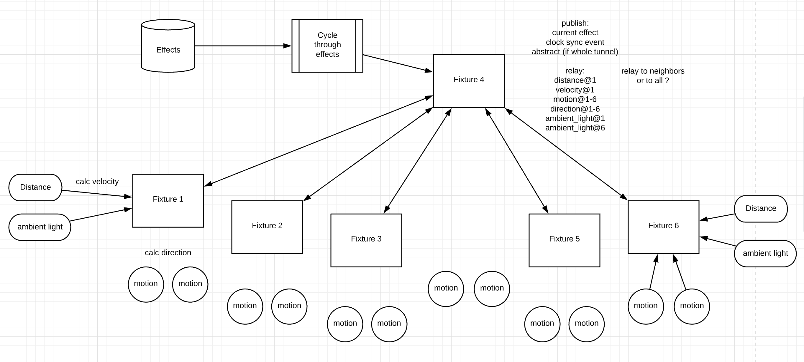

# Bluetooth

The Raspberry Pis we are using are 3 B+. They have Bluetooth v4.2 and are capable of both classic and low-energy modes. We will be using the low-energy (BLE) mode for this project. This is the [official site](https://www.bluetooth.com/develop-with-bluetooth/). There is way more info there than needed. A better option is to download the book "Intro to Bluetooth Low Energy" from [Novel Bits](https://www.novelbits.io/products).

We will be creating and using a Generic Attribute Profile (GATT) which has the hierarchy of
`Services > Characteristics > Descriptors`

## Services

**sensors**: All fixtures will have 2 motion sensors. Fixtures 1 & 6 will have distance sensors and ambient light sensors looking out of the tunnel.

**effects**: Each device (Raspberry Pi) will have a copy of all of the effects as part of the code. The central module will be responsible for picking what effect to run and sending that message along with a clock syncing event. What effect could be picked at random or go in order. Each effect will run for a set amount of time ex: 30 seconds - 1 minute.

## Characteristics

### sensors

Data flows from peripherals to central. Central then relays conditionally.

- distance & velocity

- motion & direction

- ambient light

### effects

Data flows from central to peripherals.

- effect id ( what effect to currently be running )

- clock sync event ( get all fixtures on the same timing )

- ?? abstract ( x, y grid for the whole tunnel, either boolean values, or a single Uint8 (0 - 255) )

> May be better to have each device calculate their section of the tunnel.

## Usage / Data

Event messages sent across a Bluetooth connection between devices are Buffers. We will need to define the different types of Buffers that will be sent. Within each device we will be preferring to use SharedArrayBuffers to communicate between Workers as opposed to messages across MessagePorts. The central module will have to parse & process some characteristic messages to determine the recipients. ( motion on fixture 2 will get sent to fixtures 1 & 3 )

## Architecture

BLE works with devices being one of either 2 types. A device is either a central module (think web server) or a peripheral (think client).

