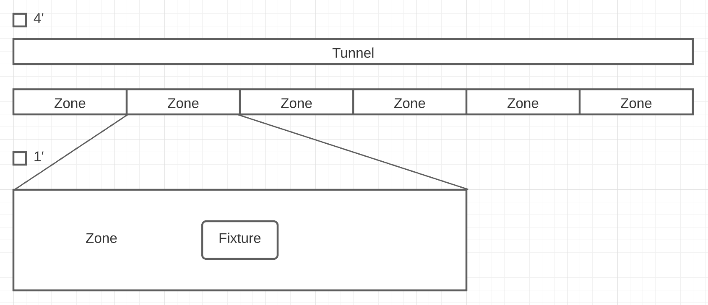
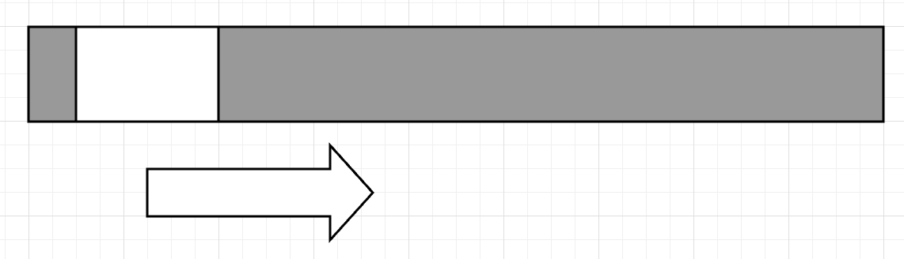

# Effects

An "effect" is a collection of functions that ultimately outputs values to the LEDs that results in an animation. This animation will "play" on a loop until the next effect is loaded. Effects can also take in values from sensors, such as motion, or audio, to alter the output as it runs.

Some simple effects would be:

- Ramp to white - all LEDs would change from their current color to white over a short transition period.
- Rainbow wheel - either an infinity mirror or the edge-lit glass would render the rainbow (each color once) in a circular pattern and that pattern would "spin".
- Wave of color - one color would be passed from one fixture to the next down the tunnel.
- Sparkles - random colors will be applied to random LEDs with a short transition time. The rest of the LEDs will remain off or a dim white (gray) to provide contrast.

Some more complex effects would be:

- Ping pong - a "ball" moves down the tunnel bouncing off of the sides, making a zig-zag pattern.
- Ocean waves - default background of a dim turquoise. A "wave" progresses down the tunnel. The crest of the wave is represented by white sparkles and brighter turquoise. Following the wave is a gradient that slowly transitions to slower and dimmer sparkles and dimmer turquoise.
- Beacon - Motion would cause "ripples" to propagate in both directions away from the source.
- Counter-rotation - The edge-lit glass would have a patten that would rotate one direction (clockwise) while the infinity mirror would have a pattern that would rotate the opposite direction (ccw).

divided into parts: abstract, transform, apply

### The Tunnel and Zones

The tunnel is 218' long and 8' wide. Divided evenly into 6 give zones that are 36' 4" long and 8' wide. Each fixture is approx. 6' long, 3' wide, and centered in a zone.



Relative to the code a "zone" is an (x, y) coordinate grid. Each fixture will have a zone, and the whole tunnel will be a zone as well. Since the zone for the whole tunnel will be a large x, y grid, we will probably want to break this into smaller zones, one per fixture. To coordinate the effects an offset per fixture will have to be assigned.

### Abstract

An abstract is a pattern, shape, or gradient that exists inside a zone, and has movement over time. A pattern or shape could be represented as boolean values whereas a gradient would be of Uint8 values (0 - 255) on the x, y grid. So a point could be either an Array `[x, y, value]` or an Object `{x, y, value}`.

The movement would be expressed over time in milliseconds (ms).

Example abstract:


Here the zone is 36 \* 4 (value of 153 for negative space), the shape is 6 \* 4 (value of 255 for positive space), and motion is 9/sec in the +x direction.

```
function movingBlock(timeMs) {
  const movement = 0.009 * timeMs;
  const xRange = 36;
  const yRange = 4;
  const xOffset = 0; // negative === left, positive === right
  let array = [];
  let value = 0;

  for (x = 0; x < xRange; x++) {
    for (y = 0; y < yRange; y++) {
      const currentX = x - movement + xOffset;
      if (currentX < 6 && currentX > 0) {
        value = 255;
      } else {
        value = 153;
      }
      array.push([x, y, value]);
    }
  }
  return array;
}
```

This would produce the above abstract as a 2 dimensional array. It does not account for looping. That is, if the positive space is completely the right of the zone, the timeMs should have the time to complete subtracted.

```
function loopTime(timeMs, timeToComplete) {
  if (timeMs > timeToComplete) {
    return loopTime(timeMs - timeToComplete, timeToComplete);
  } else {
    return timeMs;
  }
}
```

The above is a simple abstract, where the only input is time. `function(time)` More complex abstracts could also take sensor data as inputs. `function(time, sensor1, sensor2)`

Since Buffers are the common data type across this project abstract functions should return Buffers.

### Transform

A transform is a function that modifies a Buffer. An additional input can be sensor data. Transforms can be chained together.

### Apply

Take the input of a Buffer and combines with the current channel buffers to create the next write buffers.
